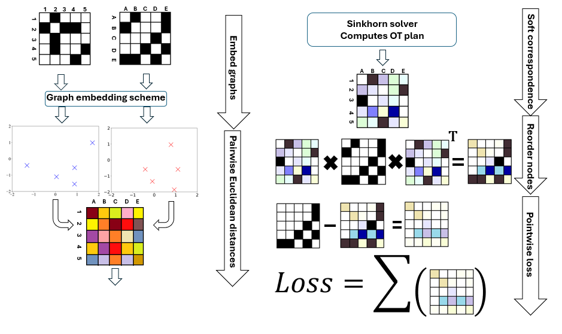

# OT-based-Molecular-generation
The process of discovering new drug-like molecules typically requires years of development and substantial financial investments, limiting the development of new drugs, the improvement of treatments and the accessibility to medications on a global scale. The advancements of computational power and machine learning methods enable the application of deep learning to generate new molecules, coined as \textit{in silico} drug discovery. Particularly, graph-based methods are promising  because they leverage the inherent structure of molecules represented as graphs.
However, the inherent complexity of graph structures poses a challenge in defining a single, comprehensive similarity measure between graphs. A popular approach to address this is graph matching, which seeks to establish a similarity-induced correspondence between the nodes of two graphs, enabling pairwise comparison of nodes and edges. The development of enhanced, scalable, and efficient methods for identifying correspondences between graphs continues to be a significant research focus in advancing graph-based approaches. In this thesis, we introduce a novel \textit{soft} graph matching scheme as similarity measure for small molecular graphs that is differentiable, meaningful, permutation invariant, while aiming to find a many-to-many correspondence that incorporates uncertainty for structure mapping. The proposed soft graph matching is grounded in optimal transport theory and utilizes the entropic-regularized Wasserstein distance, which recently has gained popularity as an effective measure for high-dimensional probability distributions in machine learning. We apply soft graph matching to a variational autoencoder framework to evaluate the reconstruction quality of molecular graphs. We show that our soft graph matching approach builds an expressive similarity measure for molecular graphs that can be applied to a deep learning setup. Furthermore, we find that the entropic-regularized Wasserstein distance establishes a meaningful similarity metric, that could find application beyond deep learning[.

